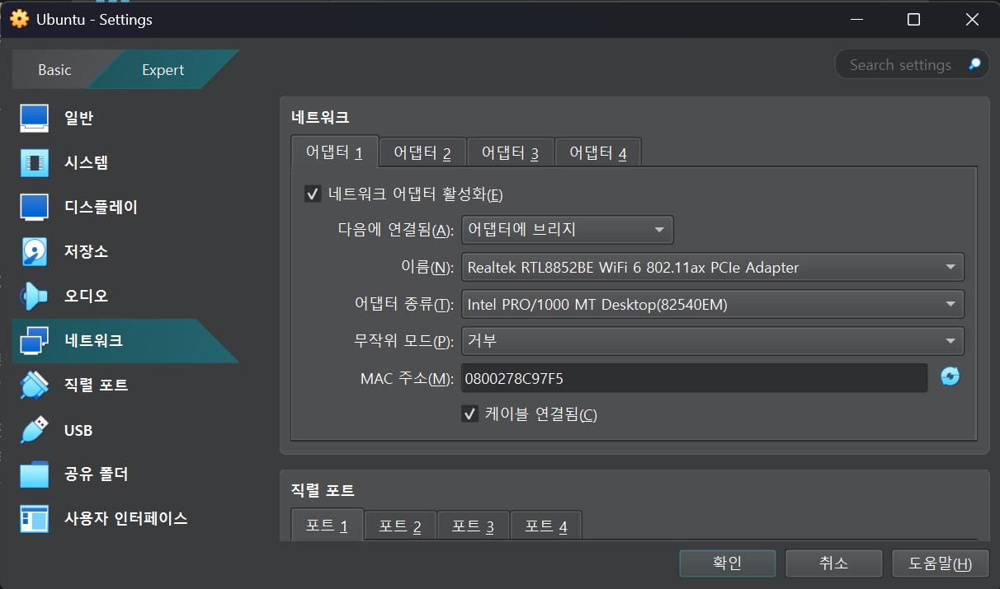
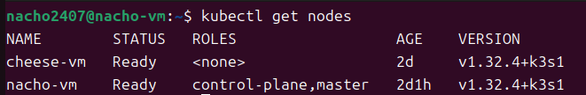
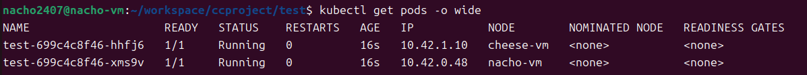

# K3s 클러스터 구성

부산대학교 정보컴퓨터공학부 2025학년도 1학기 클라우드 컴퓨팅(김태운 교수님) 텀 프로젝트

> **K3s 기반 다중 노드 Kubernetes 환경에서 안정적인 운영이 가능한 수강신청 서비스 개발**

- K3s 클러스터 구성 파트


## 구현 순서

- [x] K3s 노드 설정 / 마스터 - 워커 연결

- [x] 부하 분산

- [ ] 자동 확장

- [ ] Prometheus 서버 구성

- [ ] 시스템 통합


## K3s 노드 설정 / 마스터 - 워커 연결

우선 K3s 환경을 구성할 시스템 환경을 설정한다. 다중 노드 K3s 시스템에서 각 노드들은 클러스터 내에서 **다른 노드들이 자신을 식별할 IP 주소를 설치 시 미리 설정**하고, 해당 IP 주소의 **정해진 포트로 통신**한다.

때문에 각 노드들이 서로 다른 네트워크 환경에 위치하여 다른 IP 주소, 다른 공유기를 사용 중이라면 통신 시 해결해야 할 장벽들이 많이 존재한다. 특히 교내 Wi-Fi 환경에서 클러스터를 구성하는 경우, **각 노드가 정보를 수신하기 위한 포트를 일일이 뚫어주어야(포워딩) 하기 때문에** 구성에 어려움이 있다. 이 문제를 해결하기 위해 **홈 라우터를 기준으로 동일한 LAN 환경 내에서 노드 간 사설 IP 주소를 통해 서로를 식별하도록 구성한다.** 쉽게 말해, 집에 있는 공유기를 이용하여 작은 데이터센터를 운영한다고 보면 된다.

K3s에서 노드 간 통신을 위해 사용하는 포트는 다음과 같다.

| 목적 | 포트 | 프로토콜 | 대상 |
|------|------|----------|------|
| K3s API 서버(`kubectl`) 접근 | 6443 | TCP | 마스터 |
| flannel VXLAN(파드 간 CNI) | 8472 | UDP | 마스터 / 워커 |
| NodePort 서비스 접속 | 30000 ~ 32767 | TCP / UDP | 마스터 / 워커 |

`kubectl`의 경우 외부에서 접속할 일이 없으면 크게 고민하지 않아도 되고, NodePort 또한 Ingress 서버 등 다른 서비스 방법을 이용한다면 그에 따른 다른 포트를 사용한다.

이 포트들은 단순히 포워딩만 해주면 끝나는 것이 아니라, 방화벽 인바운드 규칙 등 여러 설정을 통해 통신이 허가되어야 한다.


### 운영체제

컨테이너 오케스트레이션을 위해 존재하는 K3s는 기본적으로 컨테이너 가상화가 가능한 환경에서 작동해야 하므로 각 노드는 Linux 환경에서 동작해야만 하는데, 현재 마스터 노드로 사용할 데스크탑 컴퓨터는 Windows 10, 워커 노드로 사용할 랩탑 컴퓨터는 Windows 11 상에서 동작 중이다. 이전에 Docker의 경우에는 Windows에서 WSL을 사용하여 원활하게 사용이 가능했기에 이번에도 WSL을 이용하여 K3s 구성을 시도해보았으나, 노드 연결까지는 가능하더라도 flannel VXLAN이 정상적으로 작동하지 않았다. Windows - WSL 간 `netsh`(포트 포워딩) 설정을 제대로 하지 않았거나, Windows 방화벽 설정에 문제가 있었던 것 같다.

조사 결과 애초에 K3s 환경을 Windows 상에 WSL로 구성하는 경우가 없기도 하고, 이 경우에는 방화벽 설정 등 손 대야할 부분이 너무 많은 것 같아서 그냥 VirtualBox로 Ubuntu 가상 머신을 올려서 방화벽 다 끄고 구성하기로 한다. Windows 방화벽에 막히는 것을 막기 위해 VirtualBox 가상 머신은 홈 라우터에 바로 붙어 사설 IP 주소를 할당받을 수 있는 '어댑터에 브리지' 모드로 사용하도록 한다.



---


### 포트 포워딩

기존에 WSL로 구현할 때는 홈 라우터 포트 포워딩, Windows 방화벽 인바운드 규칙 설정, Windwos - WSL 네트워크 중계를 위한 `netsh` 설정, WSL 내 방화벽 설정 등등 포트 관련 수많은 설정이 필요했으나, 그냥 가상 머신 상에 방화벽 다 끄고 K3s 노드를 설정하는 경우 단순히 홈 라우터 포트 포워딩만 구성해주면 된다.


LAN의 게이트웨이 주소로 접속하여 홈 라우터 설정 페이지를 연 다음, 포트 포워딩 설정 화면에서 위 사진과 같이 포트를 터준다. 사실 6443 / TCP 포트는 외부에서 `kubectl`에 접근할 일이 없으면 열지 않아도 되고, 8472 / UDP 포트도 클러스터 내에서만 필요한 포트라 홈 라우터 포트 포워딩까지는 필요 없지만 혹시 몰라서 그냥 열어 두었다. WSL로 테스트할 때처럼 지옥을 또 경험하고 싶지는 않다.

**NodePort 서비스를 사용할 경우 반드시 30000번 이상의 포트 번호를 사용해야 한다.** 이번 프로젝트에서 구현할 서비스는 웹 서비스이므로 친숙한 80번 포트를 이용해 30080번 포트를 NodePort 접근용 포트로 사용한다. 외부에서는 80번 포트로 접근하도록 하여 웹 브라우저에서 포트 번호를 따로 명시하지 않고도 접속할 수 있도록 한다.

중요한 것은 포워딩할 IP 주소가 가상 머신이 돌아가는 호스트 OS의 네트워크 인터페이스에 할당된 사설 IP 주소가 아니라, 동일한 물리 네트워크 인터페이스를 사용하기는 하더라도 '어댑터에 브리지' 모드로 가상 머신을 사용하는 만큼, **가상 머신의 가상 네트워크 인터페이스에 할당된 사설 IP 주소로 포워딩**해주어야 한다는 것이다.

이후 가상 머신에서 방화벽을 모두 열어준다.

```Bash
sudo ufw disable
sudo ufw status
```


---


### 마스터 노드 설치

이제 마스터 노드로 사용할 가상 머신에서 K3s를 설치한다. K3s는 인터넷에서 단일 바이너리 파일을 받아 일부 환경 변수와 함께 설치해주면 된다.

```Bash
sudo apt update
sudo apt upgrade
sudo apt install build-essential curl
curl -sfL https://get.k3s.io | sh -s - server --node-ip <가상 머신의 사설 IP> --tls-san <가상 머신의 사설 IP> [--tls-san <추가로 사용할 DNS 주소>]
```

`node-ip`를 통해 클러스터 내에서 노드를 구분할 IP 주소를 알려준다. 외부에서 마스터 노드에 접근하거나 클러스터 내 노드 간 통신 시에는 K3s가 자동으로 TLS 인증서를 생성하여 인증 작업을 수행하는데, 만약 외부 DNS 주소를 사용할 예정이면 인증 과정에서 문제가 생기지 않도록 `tls-san`을 통해 추가로 명시해준다.

K3s의 설정 파일은 시스템 디렉토리 내에 존재하기 때문에, `kubectl`을 사용할 때마다 `su` 권한을 받아야 하는 불편이 있다. 좀 더 편하게 관리하기 위해 설정 파일을 홈 디렉토리로 옮겨온다.

```Bash
sudo cp /etc/rancher/k3s/k3s.yaml ~/.kube/config
sudo chown $USER:$USER ~/.kube/config
```

이를 K3s 환경 변수 `KUBECONFIG`를 통해 따로 설정하지 않고 바로 사용할 수 있도록 아래 명령어를 통해 `.bashrc` 파일에 추가해둔다.

```Bash
echo 'export KUBECONFIG=/etc/rancher/k3s/k3s.yaml' >> ~/.bashrc
source ~/.bashrc
```

DNS 사용을 위해 K3s 마스터 설치 시 `tls-san`을 설정해 두었다면 K3s 설정 파일에서도 `kubectl` 서버 주소를 `127.0.0.1`에서 DNS 주소로 변경해 주어야 한다.

```YAML
server: https://<DNS 주소>:6443
```

---


### 워커 노드 설치 & 마스터 - 워커 연결

**K3s에서 마스터 - 워커 노드 연결은 워커 노드 설치 시에 바로 수행된다.** 때문에 우선 마스터 노드의 IP 주소와 특정 토큰 값을 추가로 넘겨주어 지금 이 가상 머신에 설치하는 노드가 워커 노드라는 것을 K3s 설치 시에 확인한다.

마스터 노드의 토큰 값은 마스터 노드에서 아래 값을 통해 확인한다.

```Bash
sudo cat /var/lib/rancher/k3s/server/node-token
```

이후 워커 노드에서 아래와 같이 설치한다.

```Bash
sudo apt update
sudo apt upgrade
sudo apt install build-essential curl
curl -sfL https://get.k3s.io | K3S_URL=https://<마스터 노드의 사설 IP 주소>:6443 K3S_TOKEN=<마스터 노드에서 확인한 토큰 값> sh -s - --node-ip <워커 노드의 사설 IP 주소>
```

마스터 노드에서 아래와 같이 확인할 수 있으면 마스터 - 워커 연결에 성공한 것이다.

```Bash
kubectl get nodes
```




## 부하 분산

이제 본격적으로 부하 분산 기능을 사용해본다.


### 간단한 서버 개발

우선 FastAPI를 이용해 작성한 간단한 서버를 구성한다. 서버는 간단하게 현재 해당 서버가 실행되고 있는 노드 이름과 방문자 수를 출력한다.

```Python
from fastapi import FastAPI, Request
from fastapi.responses import HTMLResponse
import os

app = FastAPI()
count = 0
hostname = os.getenv("NODE_NAME", "unknown")

@app.get("/", response_class = HTMLResponse)
async def hello(request: Request):
    global count
    count += 1

    html = f"""
    <html>
        <head><title>Hello from {hostname}</title></head>

        <body style="font-family:sans-serif; text-align:center; padding-top:3em;">
            <h1>👋 Hello, world!</h1>

            <p>🐳 Served from node: <strong>{hostname}</strong></p>

            <p>📊 Visitor number: <strong>{count}</strong></p>
        </body>
    </html>
    """
    
    return HTMLResponse(content = html)

```

---


### 서버 컨테이너화

서버를 컨테이너화하기 위한 컨테이너 이미지를 Docker를 이용해 생성한다. Dockerfile은 아래와 같이 작성한다.

```Dockerfile
FROM python:3.13-slim

WORKDIR /app
COPY test.py .

RUN pip install fastapi uvicorn

CMD ["uvicorn", "test:app", "--host", "0.0.0.0", "--port", "80"]
```

Python 3.13의 slim 버전 이미지를 기반으로 `fastapi`, `uvicorn`을 pip로 설치 후 80번 포트로 실행한다. 이미지는 아래와 같이 생성하고 Docker Hub에 등록한다.

```Bash
cd <Dockerfile이 있는 위치>/
docker build -t <Docker Hub 아이디>/test .
docker login
docker push <Docker Hub 아이디>/test
```

---


### 배포 파일 작성

K3s로 Docker Hub에 등록한 서버 이미지를 배포하기 위해 설정 파일을 작성한다. YAML 파일을 이용하여 Kubernetes 환경에서 배포에 필요한 설정들을 작성하는데, 현재 상황에서는 크게 **파드의 생성, 복제, 업데이트를 관리할 Deployment**와 **파드에 접근하기 위한 네트워크 엔드포인트를 생성하는 Service**만 작성한다. 쉽게 비유하자면 Deployment는 가게를 여는 주인이고, Service는 고객들이 가게를 찾을 수 있도록 안내하는 간판이라고 보면 된다.

우선 Deployment 부분을 작성한다.

```YAML
apiVersion: apps/v1
kind: Deployment
metadata:
    name: test
spec:
    replicas: 2
    selector:
        matchLabels:
            app: test
    template:
        metadata:
            labels:
                app: test
        spec:
            containers:
                - name: fastapi
                  image: nacho2407/test
                  ports:
                      - containerPort: 80
                  env:
                      - name: NODE_NAME
                        valueFrom:
                            fieldRef:
                                fieldPath: spec.nodeName

```

2개의 파드를 클러스터 내에 배포하도록 설정하면 **자동으로 여러 노드에 균일하게 파드를 배포한다.** `template` 부분의 `env`로 `NODE_NAME` 환경 변수를 설정하는 것은 서버 상에서 Python의 `os.getenv`를 통해 현재 서버가 실행 중인 노드의 이름을 받아오기 위해 설정해두는 것이다. 단순히 `socket`에서 호스트 이름을 받아 출력하면 노드 이름이 아니라 파드 이름을 출력한다.

이제 외부에서 해당 파드들에 접근할 수 있도록 Service 부분을 작성한다. Service에는 NodePort, Ingress 등 다양한 방법을 통해 파드에 접근하도록 할 수 있지만, 이 상황에서는 간단하게 사용할 수 있도록 NodePort를 통해 Service를 정의한다.

원래 YAML은 객체마다 독립적인 파일을 작성해야 하지만, `---`를 통해 하나의 파일에 여러 객체를 정의할 수 있다.

```YAML
---
apiVersion: v1
kind: Service
metadata:
    name: test
spec:
    type: NodePort
    selector:
        app: test
    ports:
        - port: 80
          targetPort: 80
          nodePort: 30080

```

**`selector`에 접근할 파드의 이름을 정의해두면 설정한 포트로 요청이 들어올 때마다 해당 요청을 동일한 이름의 파드들에 라운드로빈 방식으로 분배한다.**

외부에서 사용자가 클러스터에 접근할 때는 `nodePort`에 정의한 포트로 접근하며, 해당 접근은 Kubernetes Service에 `port`에 정의한 포트로 연결된다. 이후 Kubernetes Service는 이 요청을 `targetPort`에 정의한 포트로 각 파드에 분배한다.

현재는 각 서버가 80번 포트로 오는 요청을 처리하고 있으므로 `targetPort`를 80으로 설정한다. 외부에서 접근하기 위한 `nodePort`는 홈 라우터 포트 포워딩에서 80:30080을 설정하였기 때문에 30080으로 설정한다. LAN 외부 환경에서 접근할 때는 단순히 80번 포트로 접속하면 된다.

---


### K3s 배포

마침내 부하 분산을 테스트할 준비가 되었다. 작성한 YAML 파일을 이용해 K3s에 서비스를 배포하여 부하 분산이 정상적으로 작동하는지 테스트한다. K3s 배포는 아래 명령어를 통해 간단하게 배포할 수 있다.

```Bash
kubectl apply -f ./test.yaml
```

이후 배포가 정상적으로 되었는지 확인하기 위해 아래 명령어를 통해 클러스터 내 파드 분포를 확인한다.

```Bash
kubectl get pods -o wide
```



웹 브라우저에서 실제 접속이 잘 되는지 확인한다.


웹 브라우저가 새로고침될 때마다 라운드로빈 방식으로 각 Pod의 응답을 받을 수 있다.


## 자동 확장(HPA)

*추가 예정*


## Prometheus 서버 구성

*추가 예정*


## 시스템 통합

*추가 예정*
