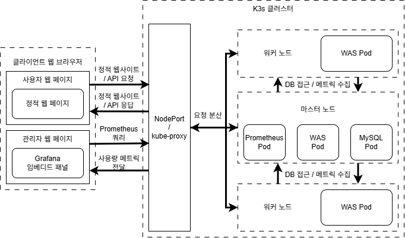

# 제안서

## 프로젝트 주제

K3s 기반 다중 노드 Kubernetes 환경에서 안정적인 운영이 가능한 수강신청 서비스 개발

## 프로젝트 소개

본 프로젝트는 대학생의 입장에서 가장 친숙하면서 사용량의 급격한 변화가 잦은 수강신청 서비스에서, 사용자가 급격하게 몰리더라도 안정적인 운영이 가능하도록 자동 확장 및 부하 분산 기능을 갖춘 수강신청 웹 서비스를 K3s 기반의 다중 노드 Kubernetes 환경에서 설계 및 구현하는 것을 목표로 한다.

FastAPI 기반의 수강신청 서버를 다중 노드에 배포하고 CPU 사용률 기반의 HPA(Horizontal Pod Autoscaler)를 적용하여 자동 확장 및 부하 분산 기능을 구현하며, 그 과정을 Prometheus 및 Grafana를 통해 실시간으로 시각화하는 시스템을 구축한다. 로컬 네트워크 상의 3대의 노드(1 마스터 + 2 워커)로 구성된 K3s 클러스터를 구성하고, 수강신청 API 서버를 컨테이너화하여 클러스터에 배포한다. 이 서버는 실제 수강신청 서비스를 모델로 하며, 사용자 요청에 따라 수강 인원을 증가시키는 기능을 가진다. 추가로 원활한 시연을 위해 부하 유도용 엔드포인트도 함께 제공하여 트래픽의 급격한 증가 상황을 시뮬레이션할 수 있다.

HPA 설정을 통해 부하에 따라 Pod 수가 자동으로 증가하고, 이 Pod들이 워커 노드에 자동으로 분산 배포되는 오토스케일링 과정을 편하게 확인할 수 있도록 관리자 홈페이지를 개발하여 시각화한다. Prometheus를 활용해 클러스터 리소스 및 HPA 상태를 수집하고, Grafana 대시보드를 구성하여 Pod 수 변화, CPU 사용률, 노드별 부하 분산 현황을 시각적으로 표현함으로써 Kubernetes 환경에서의 자동 확장과 안정성 확보 메커니즘을 시연 가능한 형태로 구현한다.

## 제안하는 SW/시스템의 구성도

- 사용자 웹 페이지

    - 일반 사용자용 수강신청 UI

    - 정적 웹 페이지에서 fetch 요청

    - Grafana

        - Prometheus에서 수집한 데이터 시각화

- 관리자 페이지

    - 별도 웹 UI 제공

    - Grafana 대시보드를 iframe 등으로 임베딩하여 시각적 모니터링 제공

- WAS Pod

    - 수강 신청 API 제공 (/courses, /enroll, /load 등)

    - HPA에 의해 부하 증가 시 자동으로 복제 및 확장

- MySQL Pod

    - 수강 내역 저장

    - 모든 WAS Pod가 공유 접근

- Prometheus Pod

    - WAS Pod, 마스터 및 워커 노드, HPA 등에서 사용량 메트릭 수집
