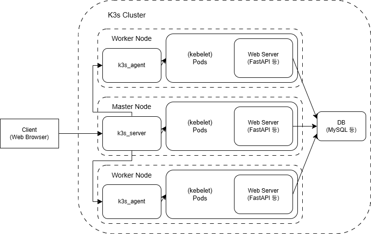

# Kubernetes Study

## Kubernetes(K8s)

- 많은 컨테이너를 자동으로 관리해주는 분산 시스템 플랫폼

- 핵심 개념

    - Container: 프로그램을 격리된 환경에서 실행하는 단위

    - Pod: Kubernetes에서 가장 작은 배포 단위(1개 이상의 컨테이너 포함)

    - Node: 실제 Pod가 배포되는 물리 서버 또는 VM

    - Cluster: 여러 노드들이 모여 있는 전체 시스템

    - Control Plane: 클러스터 전체를 제어하는 중앙 관리자

    - `kubelet`: 각 노드에서 Pod를 생성 / 삭제하는 에이전트

    - `scheduler`: 어떤 Pod를 어떤 노드에 배포할지 결정

    - API 서버: 모든 Kubernetes 명령이 통신하는 API 진입점

    - `kubectl`: Kubernetes를 제어하는 CLI 도구

- Kubernetes로 가능한 일

    - 자동 배포: 원하는 컨테이너 수를 선언만 하면 자동으로 배포

    - 자동 확장: 부하에 따라 컨테이너 개수 자동 조절

    - 셀프 힐링: 죽은 컨테이너 자동 재시작

    - 부하 분산: 요청을 여러 Pod에 자동 분배(여러 계층에서 수행됨)

    - 롤링 업데이트: 서비스 중단 없이 버전 업데이트 가능

## K3s

- Rancher Labs에서 개발한 Kubernetes를 가볍고 단순하게 만든 버전

- 기존 K8s는 너무 무겁고 설치가 복잡하여 로컬 테스트, IoT, 소형 서버, 교육용 등으로는 적합하지 않음

- 특징

    - K8s의 일부 기능 제거를 통한 경량화

    - curl 등을 통한 빠른 설치

    - 500MB 이하의 낮은 메모리 사용량

    - `k3s` 단일 바이너리 파일을 통해 모든 작업 수행

    - `kubectl` 등 K8s의 모든 기능 호환

    - 임베디드 DB 지원(MySQL, SQLite 등도 사용 가능)

## containerd

- Kubernetes에서 기본으로 사용되는 컨테이너 런타임

- 클라우드 기술 관련 표준 관리 기구 CNCF에서 관리하는 표준 컨테이너 런타임

- Docker의 내부 구성요소에서 시작했지만, 현재는 독립 오픈소스로 분리됨

- CNCF에서 컨테이너 표준을 관리하기 전에 Docker가 개발되어서, 표준이 제정된 후에는 Docker가 따르지 못한 컨테이너 표준이 많았음.
  
  때문에 CRI(Container Runtime Interface)라는 표준을 통해 런타임과 통신하도록 개발된 Kubernetes는 CRI를 지원하지 않는 Docker와 직접적인 연결을 수행할 수 없었고, 기존에는 `dockershim`이라는 어댑터를 통해 연결하였지만 비효율 + 버그 + 보안 문제 등으로 인해 현재는 Docker에 대한 공식적인 지원이 종료됨.

  대신 Kubernetes는 Docker 내부에서 사용되던 containerd를 직접 사용하도록 변경됨.

  그럼에도 Docker 이미지는 OCI(Open Container Initiative) 표준을 따르기 때문에, Docker 뿐 아니라 containerd, Podman 등 대부분의 컨테이너 런타임에 동일하게 사용할 수 있음

- 특징

    - 불필요한 기능 없이 컨테이너 실행에 집중하여 경량에 빠름

    - CRI를 지원하여 `kubelet`이 containerd와 직접 통신 가능

    - 단순한 구성으로 장애 가능성이 낮음

## 주제 제안 구체화

> **K3s 기반 다중 노드 Kubernetes 환경에서 수강신청 서버를 배포하고, HPA를 통한 자동 확장과 부하 분산 작동을 시각적으로 시연**

- 꼭 수강 신청 시스템이 아니더라도, 티켓팅이나 열차표 예매 등 사용량이 급격하게 늘어나는 상황이 잦은 시스템에 적용 가능

- 기본적으로 하나의 노드(마스터)에서 수강 신청 서버를 구동하다가 사용량이 급격하게 늘어나면 클러스터 내의 다른 워커 노드에 새로운 수강 신청 Pod 생성 및 구동

- 두 대의 노드만 서버용으로 사용하고 한 대의 노드는 DB만을 위한 노드로 사용할 수도 있음

### K3s에서 작업해야 하는 부분

- K3s를 통해 구현하는 경우 YAML 파일을 통해 리소스만 선언하면 나머지는 K3s가 자동으로 처리함

    - `kube-apiserver`: 클러스터 API 서버 자동 실행됨

    - `scheduler`: Pod 배치 로직 자동 실행됨

    - `controller-manager`: 상태 감시 및 HPA 등 처리 자동

    - `containerd` 런타임: Docker 없이 컨테이너 실행 가능

    - 내부 DB: `sqlite` 자동 설정됨

    - 인증 / TLS: `kubelet` 간 인증, 노드 간 통신 모두 자동 인증서 발급

- 직접 설정해야 하는 부분(through YAML)

    - `Deployment`: 어떤 앱을 몇 개의 Pod로 배포할지

    - `Service`: 외부나 내부에서 접근할 방법(접속 포트 번호 등)

    - `HPA`: CPU / 메모리 사용량 기준으로 Pod 자동 확장 설정

    - `ConfigMap`(앱에 필요한 환경변수, 설정파일 등), `Secret`(비밀번호) 등

    - `PersistentVolumeClaim`(선택): DB 등 상태 저장이 필요한 경우

- 부하 분산 알고리즘은 기본적으로 라운드 로빈 방식이나, 필요하면 `kube-proxy` 설정으로 직접 설정할 수도 있음

### 시각화

- Prometheus

    - CPU / 메모리 사용률, Pod 개수 등 메트릭 데이터를 수집하고 저장하는 시스템

    - Kubernetes의 메트릭 서버나 노드에서 주기적으로 리소스 사용 정보를 가져옴

- Grafana

    - Prometheus에서 수집한 데이터를 시각화하는 대시보드 도구

    - Prometheus에 저장된 데이터를 쿼리하여 그래프로 시각화

    - Kubernetes에 특화된 템플릿이 많아 빠르게 구성 가능

=> 제작한 시스템의 자동 확장, 부하 분산을 시각화하여 시연하기 위해 Prometheus / Grafana를 이용해 관리자 페이지 등을 제작할 수 있음

### 영역 별 구현 내용 정리

- 프론트엔드

    - HTML + JS등으로 수강 신청 UI 정적 웹 페이지 개발

        - `fetch`로 API 호출

    - 관리자 페이지에서 K3s 클러스터의 Prometheus 데이터를 쿼리하여 Grafana를 통해 시각화

        - HTML `<iframe>` 이용 또는 JS에서 Prometheus API를 직접 호출하여 시각화

    - (선택) 부하 발생을 위한 테스트 코드 생성

        - `hey`, `ab`, `wrk` 등을 통한 트래픽 발생

- 백엔드

    - FastAPI등을 통한 수강 신청 서버 구현

        - API 설계 및 비즈니스 로직(신청 인원 증가, 좌석 제한, 중복 방지 등) 처리

        - 사용자 인증 / 권한 처리(JWT 로그인 API)

    - 제작한 서버를 Docker 이미지로 제작

        - Dockerfile 작성

    - DB 스키마 구성 및 서버와 연동

    - (선택) 부하 유도 엔드포인트 추가

        - `/load`등 요청을 받으면 별도 로직 없이 CPU나 메모리 사용량을 소모하기 위한 엔드포인트

- 클라우드

    - K3s 클러스터 구성

        - 마스터 + 워커 노드 연결

    - `Deployment` / `Service` 작성

        - K3s에 배포할 YAML 작성

    - 외부에서 웹 / API 요청 등을 클러스터에서 받아 처리할 수 있는 `NodePort` 설정

    - 자동 확장(HPA) / 부하 분산 설정

    - 데이터 시각화를 위한 Prometheus 설정
