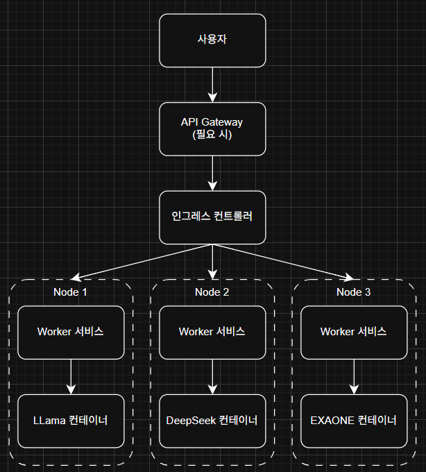

# ✔ 주제 제안

## 추가로 생각해야 할 선정 기준(제안서 작성 목록 기준)

- 유용성(필요성 및 활용방안)

- 창의성(선행기술 조사)

## 활용 기술

- VirtualBox, Docker, OpenStack, Public Cloud Computing Service(Amazon AWS, Microsoft Azure 등)

## 제안 주제

### Kubernetes를 활용한 '다운되지 않는' 수강신청 서비스 개발

- 주요 키워드: 컨테이너 가상화, Kubernetes(K3s), Auto-scaling, Load Balancing

- 프로젝트를 수행하는 대학생의 입장에서 가장 친숙하면서 사용량의 급격한 변화가 잦은 수강신청 서비스에서, 사용자가 급격하게 몰리더라도 서비스가 절대 다운되지 않도록 자동 확장 및 부하 분산 기능을 갖춘 수강신청 웹 서비스를 쿠버네티스 기반으로 설계 및 구현

- 예시 구조

  

    - 필요 시 API Gateway(직접 구현하거나 퍼블릭 클라우드 서비스 이용)를 추가할 수 있음

    - 인그레스 컨트롤러: 사용자에게 받은 요청을 API 종류 별로 쿠버네티스 클러스터 내의 다른 서비스에게 라우팅(HTTP단 부하 분산)

    - 쿠버네티스 서비스: 해당하는 서비스로 오는 많은 요청을 Pod 중 하나로 부하 분산

        - auth 서비스: 계정(사용자 인증) 관련

        - course 서비스: 강의 목록, 수강 신청 관련

        - admin 서비스(선택): 강의 등록, 수강자 목록 확인 등

    - 쿠버네티스 파드: 서버를 구성하는 여러 컴포넌트 컨테이너의 모음(하나의 컨테이너로도 구성 가능)

- 퍼블릭 클라우드를 이용하여 구현할 수도 있지만, 도커와 쿠버네티스를 이용하여 직접 부하 분산 및 자동 확장 기능을 구현하여 기술적인 면을 시험해볼 수 있음

- 수업 시간에 배운 클라우드 컴퓨팅 기술들을 최대한 활용할 수 있지만, 창의성은 다소 떨어짐

### AWS를 활용한 실시간 상태 공유 테트리스 서비스 개발

- 주요 키워드: Public Cloud Computing Service, Real-time Multiplay, AWS Lambda(이벤트 기반), API Gateway, DynamoDB

- 웹 기반 테트리스 게임을 AWS 클라우드 환경에서 서비스하고, 여러 사용자가 실시간으로 상태를 공유하며 게임을 진행할 수 있는 시스템을 구축

    - 화면 예시

      

    - 각 플레이어의 게임판 상태는 실시간으로 공유되어, 참가자들은 다른 플레이어의 진행 상황을 동시에 시각적으로 확인할 수 있음

- 예시 구조

  

    - Amazon S3: 웹 게임 클라이언트 파일을 저장하면서, 사용자에게 페이지 호스팅

    - Amazon API Gateway: 게임 내에서 발생하는 API 요청들을 처리(WebSocket 방식 가능)

    - AWS Lambda: API 응답을 위한 내부 로직(서버리스)

    - Amazon DynamoDB: 사용자 상태(계정 정보, 게임 상태 등) 관리를 위한 NoSQL DB

- AWS 사용에 익숙해지면 구현은 다소 간단해지나, 전반적으로 퍼블릭 클라우드를 이용한 서버리스 서비스 구현 내용을 보여줄 수 있음

### 경량 LLM 컨테이너의 Kubernetes 기반 분산 오케스트레이션 활용 챗봇 서비스 개발

- 주요 키워드: Kubernetes(K3s), 멀티 노드, Ollama, 컨테이너화 된 경량 LLM

- 여러 대의 컴퓨터(노드)에 경량 LLM 모델을 컨테이너화하여 배포하고, 이를 쿠버네티스로 통합 관리하여 목적에 따라 요청 내용에 따른 부하 분산 / 사용량에 따른 부하 분산 / 여러 모델에 동일한 응답을 받아 밴치마킹 등에 활용하는 서비스 개발

- 예시 구조

  

    - 하나의 컴퓨터가 아닌, 여러 컴퓨터(노드)에서 각각 다른 LLM 모델을 구동하면서, 이를 쿠버네티스를 통해 오케스트레이션

    - Ollama 컨테이너(`ollama/ollama`)는 내부적으로 RESTful API를 제공하며, 요청 / 응답 모두 JSON 형식으로 통신 가능(포트포워딩 필요)

- 구현 난이도가 다소 높아질 수는 있으나 LLM, 쿠버네티스 기반 멀티 노드 오케스트레이션 등 다양한 기술들을 활용할 수 있음

### Log Replay 기법을 이용한 Live-stateful 컨테이너 마이그레이션 플랫폼 개발

- 주요 키워드: Log Replay 마이그레이션, Docker

- 하나의 컴퓨터에서 실행 중인 Docker 컨테이너를 다른 컴퓨터로 끊김 없이(Stateful) 실시간(Live) 마이그레이션하는 시스템 개발

- 예시 구조

  

- 아이디어는 좋지만 제한된 프로젝트 시간 내에 구현 현실성이 낮음
